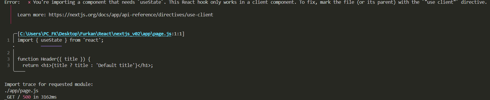

## Notes

* When you use Next.js in your project, you do not need to load the react and react-dom scripts from unpkg.com anymore. 
Instead, you can install these packages locally using npm or your preferred package manager.

* Note: To use Next.js, you will need to have Node.js version 18.17.0 or above installed on your machine.

* Run the command in the terminal to install react, react-dom and next using npm: `npm install react@latest react-dom@latest next@latest`

* We don't need most of the definitions in index.html file anymore. Instead, we will update the `index.html` with `index.js` or `index.jsx`. 

### Server and Client Environments

### Network Boundary

In React, you choose where to place the network boundary in your component tree. For example, you can fetch data and render a user's posts on the server (using Server Components), then render the interactive LikeButton for each post on the client (using Client Components).

Similarly, you can create a Nav component that is rendered on the server and shared across pages, but if you want to show an active state for links, you can render the list of Links on the client.

Behind the scenes, the components are split into two module graphs. The server module graph (or tree) contains all the Server Components that are rendered on the server, and the client module graph (or tree) contains all Client Components.

After Server Components are rendered, a special data format called the React Server Component Payload (RSC) is sent to the client. The RSC payload contains:

1. The rendered result of Server Components.
2. Placeholders (or holes) for where Client Components should be rendered and references to their JavaScript files.

React uses this information to consolidate the Server and Client Components and update the DOM on the client.

## Using Client Components

As you learned in the last chapter, Next.js uses Server Components by default - this is to improve your application's performance and means you don't have to take additional steps to adopt them.

Looking back at the error in your browser, Next.js is warning you that you're trying to useState inside a Server Component. You can fix this by moving the interactive "Like" button to a Client Component.

1. Create a new file called `like-button.js` inside the app folder that exports a `LikeButton` component.
2. Move the `<button>` element and the `handleClick()` function from `page.js` to your new `LikeButton` component.
3. Next, move the `likes` state and the import.
4. Now, to make the LikeButton a Client Component, add the React 'use client' directive at the top of the file. This tells React to render the component on the client.
5. Back in your page.js file, import the LikeButton component into your page.
